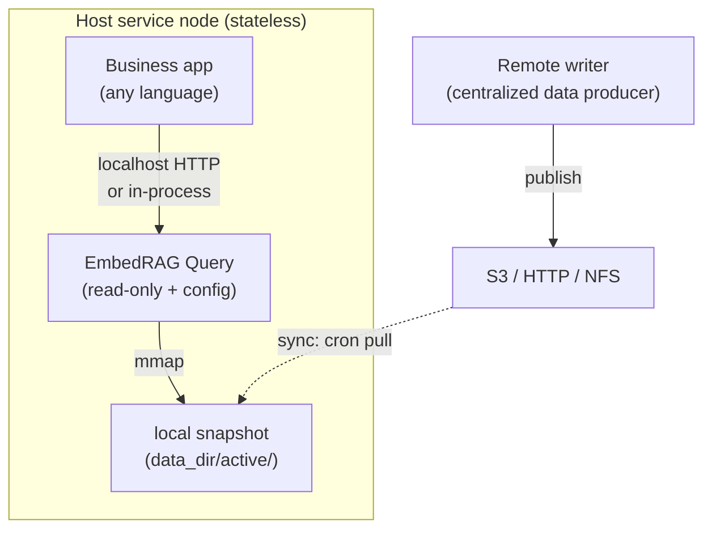
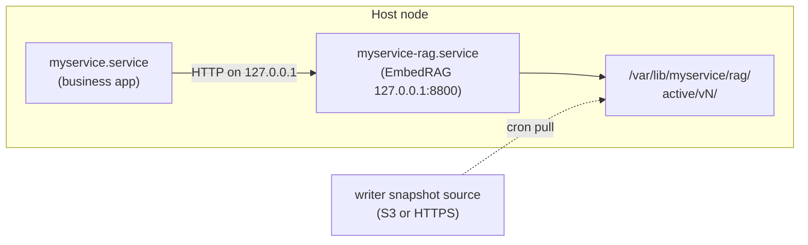
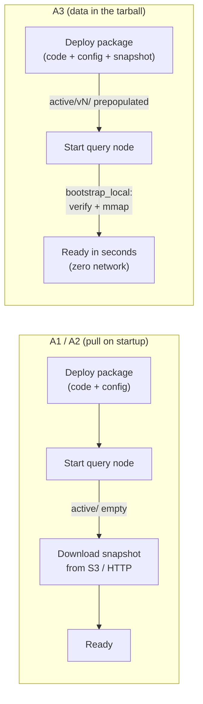
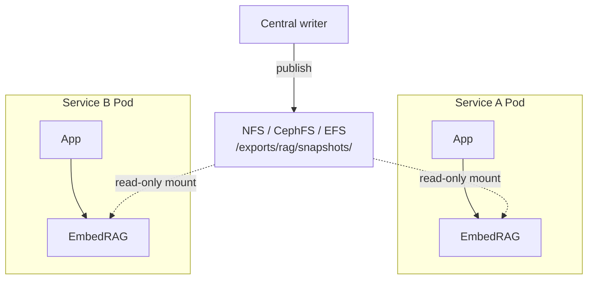

# Embedding EmbedRAG as a Sub-Capability

How to deploy EmbedRAG **inside** a host service as its internal RAG component — not as a separate networked service. The host service ships a config file, EmbedRAG runs alongside it, and snapshots are fetched automatically from a central writer.

> Looking for patterns where applications call a standalone EmbedRAG service over the network? See [integration.md](integration.md) instead.

---

## Scenario



**Core properties:**

- **Host stays stateless** — restart or rescale does not depend on local data; EmbedRAG can cold-start from the remote snapshot source.
- **Config travels with the host** — a single `rag.yaml` decides which writer to follow and how often to pull.
- **Data updates itself** — EmbedRAG's background syncer periodically checks for a new snapshot version and hot-swaps with zero downtime.
- **Zero source changes** — everything below uses stock EmbedRAG.

The code already provides all the hooks:

- [config.SyncConfig](../src/embedrag/config.py) — `enabled` / `source` / `http_url` / `cron` / `poll_interval_seconds`
- [bootstrap_query_node](../src/embedrag/query/lifecycle/bootstrap.py) — reuses local `active/` if present, otherwise downloads from remote
- [SnapshotSyncer](../src/embedrag/query/sync/syncer.py) — cron or fixed-interval polling, hot-swap via `GenerationManager`
- `GET /readiness` — returns 503 until a snapshot is loaded; perfect for host preflight
- `POST /admin/sync` — manual sync trigger; also accepts `{"snapshot_dir": "/local/path"}` for loading a specific version
- `create_query_app(config_path)` — FastAPI factory for in-process embedding

---

## Deployment options at a glance

| Option | Container? | Host language | Best for |
|--------|-----------|---------------|----------|
| A1. systemd (two units) | No | Any | Linux VMs / bare metal production |
| A2. uv one-shot | No | Any | Development, PoC, CI |
| A3. Self-contained tarball | No | Any | Air-gapped / offline edge / immutable rollouts |
| B1. In-process | N/A | Python only | Lowest latency, single Python service |
| B2. Same container, two processes | Yes | Any | "One container = one unit" ops model |
| B3. Kubernetes sidecar | Yes | Any | Clean business image, standard K8s |
| B4. Sidecar + initContainer prefetch | Yes | Any | Zero-wait rolling upgrades |
| B5. Shared ReadWriteMany snapshot | Yes | Any | Many services sharing one KB |

Options A1–A3 are container-free. Options B1–B5 are container-based. Pick whichever fits your deployment platform.

---

## A1. systemd two-unit deployment (container-free, production)

The canonical pattern for Linux VMs, bare metal, or any node where containers are not a fit. Host app and EmbedRAG each run as a systemd service on the same node, talking to each other over loopback.



### One-time node provisioning

```bash
# 1) Install uv (never pollute the system Python)
curl -LsSf https://astral.sh/uv/install.sh | sh

# 2) Create an isolated venv under the host service's prefix
sudo mkdir -p /opt/myservice/rag
sudo chown "$USER": /opt/myservice/rag
cd /opt/myservice/rag

uv venv --python 3.11 .venv
uv pip install --python .venv/bin/python \
    "embedrag @ git+https://github.com/your-org/embedRAG@v0.6.0"

# 3) Ship the host-owned RAG config
sudo install -m 0644 rag.yaml /etc/myservice/rag.yaml

# 4) Snapshot cache directory (survives restarts -> skips cold-start download)
sudo useradd --system --no-create-home myservice 2>/dev/null || true
sudo mkdir -p /var/lib/myservice/rag
sudo chown myservice:myservice /var/lib/myservice/rag
```

### `/etc/systemd/system/myservice-rag.service`

```ini
[Unit]
Description=EmbedRAG embedded retriever for myservice
After=network-online.target
Wants=network-online.target

[Service]
Type=exec
User=myservice
Group=myservice
WorkingDirectory=/opt/myservice/rag
ExecStart=/opt/myservice/rag/.venv/bin/embedrag query \
    --config /etc/myservice/rag.yaml \
    --host 127.0.0.1 \
    --port 8800
Restart=on-failure
RestartSec=3
# Resource limits
CPUQuota=200%
MemoryMax=8G
# Hardening
NoNewPrivileges=true
ProtectSystem=strict
ProtectHome=true
ReadWritePaths=/var/lib/myservice/rag
PrivateTmp=true

[Install]
WantedBy=multi-user.target
```

### `/etc/systemd/system/myservice.service` (host app excerpt)

```ini
[Service]
Environment=RAG_URL=http://127.0.0.1:8800
After=myservice-rag.service
# Do NOT use Requires= here — let the app poll $RAG_URL/readiness itself,
# so a transient EmbedRAG restart does not tear down the host app.
```

### Enable and observe

```bash
sudo systemctl daemon-reload
sudo systemctl enable --now myservice-rag.service myservice.service

# Live logs (structlog goes to stdout -> journald by default)
journalctl -u myservice-rag -f

# Probes
curl -s http://127.0.0.1:8800/health
curl -s http://127.0.0.1:8800/readiness | jq
curl -s http://127.0.0.1:8800/admin/sync/status | jq
```

### Rolling upgrade of EmbedRAG (host app keeps running)

```bash
cd /opt/myservice/rag
uv pip install --python .venv/bin/python --upgrade \
    "embedrag @ git+https://github.com/your-org/embedRAG@v0.6.1"
sudo systemctl restart myservice-rag.service
# Host app retries on 503 during the brief restart window.
```

### What happens on node restart

| State of `/var/lib/myservice/rag/active/` | Bootstrap path | Startup time |
|---|---|---|
| Previous `vN/` directory still present and intact | `bootstrap_local` — mmap + open read-only | seconds |
| Empty (fresh node or disk reset) | `bootstrap_cold_start` — download from `sync.http_url` | depends on snapshot size |

**Pros:** zero container dependency; systemd-native auto-restart, resource quotas, and log aggregation; familiar to Linux ops teams.
**Cons:** requires Python 3.11+ on the node; `uv pip install` runs once per node.

---

## A2. uv one-shot (container-free, development)

For dev machines, PoCs, CI integration tests, or lightweight self-hosted setups. No systemd, no permissions setup — just `uv run`.

### Single command per process

```bash
# EmbedRAG
uv run --python 3.11 --with "embedrag @ git+https://github.com/your-org/embedRAG" \
    embedrag query --config ./rag.yaml --host 127.0.0.1 --port 8800 &

# Host app
RAG_URL=http://127.0.0.1:8800 ./myservice
```

### Both-at-once with honcho / foreman / overmind

Put a `Procfile` in the host repo:

```procfile
rag: uv run --python 3.11 --with "embedrag @ git+https://github.com/your-org/embedRAG" embedrag query --config ./rag.yaml --host 127.0.0.1 --port 8800
app: ./myservice
```

Then:

```bash
pip install honcho       # or: brew install foreman / overmind
honcho start             # Ctrl-C stops both processes
```

**Pros:** zero configuration; 1-minute dev setup; ideal for CI integration tests.
**Cons:** no auto-restart (rely on the process manager); not meant for long-running production.

---

## A3. Self-contained tarball (container-free, data travels with the deploy)

A1 and A2 both assume the node can pull a snapshot on first start. A3 removes that assumption: the snapshot ships **inside** the deploy artifact, so the process is Ready the moment it starts — no network, no object store, no sidecar prefetch.

This works because [bootstrap_query_node](../src/embedrag/query/lifecycle/bootstrap.py) always looks at `data_dir/active/*/manifest.json` *before* it considers any remote source. If a verified snapshot is already on disk, the node mmaps it and returns. The object-store and HTTP code paths are only reached when `active/` is empty.



### When to pick it

- **Air-gapped or regulated environments** where outbound network is not allowed at startup.
- **Offline edge devices** or on-prem appliances that ship as a single image.
- **Immutable release artifacts** — the tarball is the one truth for "version X of the service *and* its knowledge base".
- **Fast, reproducible rollbacks** — rolling back the code rolls back the data, automatically.
- **Small-to-medium knowledge bases**, roughly `<=` 200 MB compressed snapshot (see sizing below).

### Build-time packaging

Run this on a CI machine that has write access to the writer's snapshot source, or on the writer node itself. It assembles a single `.tar.zst` containing the Python venv, the EmbedRAG source, the host config, and the already-published snapshot.

```bash
#!/usr/bin/env bash
# build_deploy_tarball.sh  —  produce a self-contained release artifact
set -euo pipefail

SNAPSHOT_VERSION="${1:?usage: build_deploy_tarball.sh <snapshot_version>}"
SNAPSHOT_SRC="${SNAPSHOT_SRC:-/var/lib/writer/builds/${SNAPSHOT_VERSION}}"
RELEASE_ID="$(date +%Y%m%d%H%M%S)-${SNAPSHOT_VERSION}"
STAGE="$(mktemp -d)/myservice-rag-${RELEASE_ID}"

mkdir -p "${STAGE}"/{src,data/active}

uv sync --frozen
cp -r .venv "${STAGE}/.venv"
cp -r src   "${STAGE}/src"
cp rag.yaml "${STAGE}/rag.yaml"

cp -r "${SNAPSHOT_SRC}" "${STAGE}/data/active/${SNAPSHOT_VERSION}"

tar --zstd -C "$(dirname "${STAGE}")" \
    -cf "myservice-rag-${RELEASE_ID}.tar.zst" "$(basename "${STAGE}")"
echo "built: myservice-rag-${RELEASE_ID}.tar.zst"
```

The resulting layout inside the tarball is exactly what the bootstrap looks for:

```
myservice-rag-<release>/
  .venv/
  src/
  rag.yaml
  data/
    active/
      <snapshot_version>/
        manifest.json
        db/  index/  ...
```

### `rag.yaml` for a zero-network node

```yaml
node:
  role: query
  data_dir: /opt/myservice-rag/current/data

sync:
  enabled: false        # no polling, no outbound calls

index:
  mmap: true
```

`bootstrap_query_node` finds `data/active/<snapshot_version>/manifest.json`, verifies it with `quick_verify_snapshot`, mmaps FAISS, and opens the SQLite pool — all before returning from the FastAPI lifespan. With `sync.enabled: false`, there is no background syncer thread and no outbound traffic.

### Install and upgrade on the target node

```bash
# One release directory per tarball, current/ is an atomic symlink.
RELEASE_DIR=/opt/myservice-rag/releases/${RELEASE_ID}
sudo mkdir -p "${RELEASE_DIR}"
sudo tar --zstd -C "${RELEASE_DIR}" --strip-components=1 \
    -xf "myservice-rag-${RELEASE_ID}.tar.zst"

# Atomic swap: current/ -> new release
sudo ln -sfn "${RELEASE_DIR}" /opt/myservice-rag/current
sudo systemctl restart myservice-rag

# Verify
curl -fsS http://127.0.0.1:8800/readiness
```

The systemd unit is the same one from A1, but with `WorkingDirectory=/opt/myservice-rag/current` and `ExecStart=.../current/.venv/bin/embedrag query --config /opt/myservice-rag/current/rag.yaml`. No other changes.

### Hybrid update path (emergency hotfix without a full re-deploy)

Full updates flow through new tarballs, which keeps the release artifact as the single source of truth. For urgent patches between releases, drop the new snapshot on disk and hot-swap it in place — no restart, no traffic loss:

```bash
# 1) Drop the new snapshot next to current
sudo cp -r /tmp/v1780000000 /opt/myservice-rag/current/data/hotfix/

# 2) Ask the running node to load it (routes.py handles the snapshot_dir branch)
curl -X POST http://127.0.0.1:8800/admin/sync \
    -H 'Content-Type: application/json' \
    -d '{"snapshot_dir":"/opt/myservice-rag/current/data/hotfix/v1780000000"}'
```

The `snapshot_dir` branch in [src/embedrag/query/routes.py](../src/embedrag/query/routes.py) (`trigger_sync`) verifies the manifest, calls `load_generation`, and `GenerationManager.swap()` — same hot-swap machinery the background syncer uses. The next scheduled tarball deploy re-establishes the canonical state.

### Readiness and deploy automation

Use `/readiness` as the deploy gate — it returns 200 only after the snapshot is loaded:

```ini
# myservice-rag.service excerpt
ExecStartPost=/usr/bin/bash -c 'until curl -fsS http://127.0.0.1:8800/readiness; do sleep 1; done'
```

This turns "Ready" into a hard contract for the deploy tool, so the host app is never started against a RAG that has not yet loaded its index.

### Sizing guidance

Measured from the examples bundled in this repo (compressed snapshots as they appear on disk):

- Lunyu quotes — ~6 MB — tarball overhead negligible, strongly recommended.
- Causal Inference — ~28 MB — still trivial; A3 is the obvious pick.
- Hongloumeng — ~62 MB — fine for A3; watch artifact retention policy.
- Quantangshi — ~406 MB — A3 becomes painful (slow transfer, storage blow-up across many releases). Prefer [B4 initContainer prefetch](#b4-sidecar--initcontainer-prefetch-zero-wait-rolling-upgrades) or keep the snapshot on a CDN / shared volume and ship only code + config.

As a rough rule: ship the snapshot in the tarball while it stays `<=` ~200 MB compressed; above that, decouple the two artifacts.

### Gotchas

- Pack only `data/active/<version>/`. The bootstrap auto-creates `staging/` and `backup/`; including them bloats the tarball and can mask real issues.
- Include `manifest.json` **and** all files it references (compressed shards, db, id_map). `quick_verify_snapshot` recomputes SHA256 and refuses to load if any are missing.
- `data_dir` must be writable by the EmbedRAG user — `load_generation` decompresses `*.zst` files in place on first load.
- Do not bake credentials into the tarball. Embeddings service URLs and any tokens belong in environment-specific overrides (systemd `Environment=` / `EnvironmentFile=`).
- Set `sync.enabled: false` explicitly. Forgetting it means the node will start polling a potentially unreachable source and spam the logs with retry errors.

**Pros:** truly zero-network startup; release artifact includes data; trivial rollback; works in air-gapped environments.
**Cons:** tarballs grow with the KB; one writer + many nodes duplicates storage; full data refresh requires a new deploy (mitigated by the hybrid `POST /admin/sync` path above).

---

## Host-owned `rag.yaml` template (shared across A1, A2, and all container options)

```yaml
# /etc/myservice/rag.yaml  (or ./rag.yaml in dev)
node:
  role: query
  data_dir: /var/lib/myservice/rag     # A1 systemd path; dev: ./data/rag

sync:
  enabled: true
  source: http                          # "object_store" is also supported
  http_url: "https://cdn.example.com/rag-snapshots/myservice-kb/"
  cron: "*/10 * * * *"                  # or: poll_interval_seconds: 300
  download_concurrency: 4

index:
  mmap: true
search:
  default_top_k: 5
  max_top_k: 50

embedding:
  spaces:
    text:
      service_url: "http://embedding.infra:8080/v1/embeddings"
      api_format: "openai"              # or "embedrag"
      model: "bge-m3"
```

**Three rules of thumb:**

1. `node.data_dir` **must be writable** and should persist across restarts to avoid re-downloading on every boot.
2. `sync.http_url` should point at the writer's publish directory layout: `latest.json` at the root plus per-version subdirectories containing `manifest.json` and compressed shard / db / id_map files.
3. Bind to `127.0.0.1`, not `0.0.0.0`. The host app is the only legitimate caller; exposing `/admin/*` on a public port is a risk.

The full config reference lives in [configuration.md](configuration.md).

---

## B1. In-process embedding (Python hosts only)

If the host is itself a Python FastAPI / Flask / worker process, skip the HTTP hop entirely. Mount EmbedRAG's router into your app so `/rag/search/text` runs in the same event loop.

```python
from fastapi import FastAPI
from embedrag.query.app import create_query_app

# Create EmbedRAG as a standalone app (it wires its own lifespan/bootstrap/syncer)
rag_app = create_query_app(config_path="/etc/myservice/rag.yaml")

host = FastAPI()
# Business routes
host.include_router(my_biz_router)
# Mount EmbedRAG as a sub-app. Its lifespan runs when `host` starts.
host.mount("/rag", rag_app)
```

Host code calls `POST /rag/search/text` — no network hop, one process, shared observability.

**Pros:** lowest latency; one process to manage; shared metrics and logs.
**Cons:** Python-only; FAISS / embedding client memory lives in the host process.

---

## B2. Same container, two processes (any language, one container)

Package the host app and EmbedRAG in the same image and run them together under `supervisord`. Keeps the "one container = one unit" ops model while allowing any host language.

```dockerfile
FROM python:3.11-slim
RUN apt-get update && apt-get install -y supervisor curl libgomp1 && rm -rf /var/lib/apt/lists/*
RUN pip install --no-cache-dir uv

# EmbedRAG as a pinned sub-capability
RUN uv pip install --system "embedrag @ git+https://github.com/your-org/embedRAG@v0.6.0"

# Host binary
COPY --from=biz-build /app/myservice /usr/local/bin/myservice

# Host-owned RAG config + supervisord config
COPY config/rag.yaml          /etc/myservice/rag.yaml
COPY deploy/supervisord.conf  /etc/supervisord.conf

CMD ["supervisord", "-c", "/etc/supervisord.conf"]
```

`deploy/supervisord.conf`:

```ini
[supervisord]
nodaemon=true

[program:embedrag]
command=embedrag query --config /etc/myservice/rag.yaml --host 127.0.0.1 --port 8800
autorestart=true
stdout_logfile=/dev/fd/1
stdout_logfile_maxbytes=0
priority=10

[program:myservice]
command=/usr/local/bin/myservice
environment=RAG_URL="http://127.0.0.1:8800"
autorestart=true
priority=20
```

**Pros:** language-agnostic; deployment unit is still a single container; loopback networking is free.
**Cons:** image carries the Python runtime (~200 MB).

---

## B3. Kubernetes sidecar (any language, clean business image)

Put the host app and EmbedRAG in separate containers of the same Pod. Business image stays pure; EmbedRAG comes from its own image and can be upgraded independently.

```yaml
apiVersion: apps/v1
kind: Deployment
metadata:
  name: myservice
spec:
  replicas: 3
  template:
    spec:
      containers:
        - name: biz
          image: mycorp/myservice:v1.2.0
          env:
            - name: RAG_URL
              value: "http://127.0.0.1:8800"
        - name: embedrag
          image: mycorp/embedrag:v0.6.0
          args:
            - embedrag
            - query
            - --config=/etc/embedrag/rag.yaml
            - --host=127.0.0.1
            - --port=8800
          volumeMounts:
            - name: rag-config
              mountPath: /etc/embedrag
              readOnly: true
            - name: rag-data
              mountPath: /data/embedrag
          readinessProbe:
            httpGet: { path: /readiness, port: 8800 }
            initialDelaySeconds: 20
            periodSeconds: 5
          livenessProbe:
            httpGet: { path: /health, port: 8800 }
          resources:
            limits: { cpu: "2", memory: 8Gi }
      volumes:
        - name: rag-config
          configMap:
            name: myservice-rag-config
        - name: rag-data
          emptyDir: { sizeLimit: 20Gi }
```

The `myservice-rag-config` ConfigMap contains the `rag.yaml` shown in the template section above.

**Pros:** business image stays pure; standard K8s sidecar pattern; independent upgrades.
**Cons:** extra container per Pod; initial Pod readiness waits for first snapshot pull.

**Statelessness:** `emptyDir` resets on Pod recreation — the next cold start pulls from `sync.http_url`. No PersistentVolumeClaim required.

---

## B4. Sidecar + initContainer prefetch (zero-wait rolling upgrades)

Enhancement to B3 for large snapshots where you don't want new Pods to wait for the first sync. An initContainer downloads the latest snapshot into `emptyDir` before the EmbedRAG container starts, and EmbedRAG boots via `bootstrap_local`.

```yaml
spec:
  initContainers:
    - name: snapshot-prefetch
      image: curlimages/curl:8.8.0
      command:
        - sh
        - -euc
        - |
          BASE=https://cdn.example.com/rag-snapshots/myservice-kb
          VER=$(curl -sf $BASE/latest.json | sed -n 's/.*"version":"\([^"]*\)".*/\1/p')
          DEST=/data/embedrag/active/$VER
          mkdir -p $DEST
          curl -sf $BASE/$VER/manifest.json -o $DEST/manifest.json
          # Download every compressed file referenced in the manifest
          # (filter with jq if available, or parse with sed/awk)
          # ... (project-specific loop) ...
      volumeMounts:
        - name: rag-data
          mountPath: /data/embedrag

  containers:
    - name: embedrag
      # same as B3 — on start, finds active/vN/ locally and skips the download step
```

**Pros:** Pods pass readiness in seconds; rolling deploys do not dip availability while the first sync runs.
**Cons:** initContainer logic is project-specific; keep it simple (curl + sed is usually enough).

---

## B5. Shared ReadWriteMany snapshot (multi-tenant)

When many services in the same cluster consume the same knowledge base, one shared volume avoids N-times storage and download bandwidth.



The writer publishes into the shared volume (or a symlink flip coordinator does). Each EmbedRAG pod either points `node.data_dir` at the mount and keeps `sync.enabled: false`, or lets `POST /admin/sync` with `{"snapshot_dir": "/mnt/shared/.../vN"}` drive the hot-swap (e.g. from an operator running a cron job).

**Pros:** N host services share a single physical snapshot; disk, IO, and bandwidth drop accordingly.
**Cons:** requires NFS / EFS infrastructure; watch FAISS mmap performance over network storage for large indexes.

---

## Choosing a path

- Single Python service, want lowest latency → **B1 in-process**.
- Linux VM / bare-metal fleet, no containers → **A1 systemd**.
- Dev machine, PoC, CI → **A2 uv one-shot**.
- Air-gapped, offline edge, or immutable-release node that must be Ready without network at startup → **A3 self-contained tarball**.
- Any language, single-container ops model → **B2 supervisord in one container**.
- Kubernetes with a clean business image → **B3 sidecar**.
- B3 but cold-start latency is unacceptable → **B3 + B4 initContainer prefetch**.
- Dozens of services sharing one KB → **B5 NFS**.

A1, A2, and A3 are the container-free answers to "deploy EmbedRAG straight onto the service node". B1–B5 cover container platforms at increasing levels of K8s sophistication.

---

## Troubleshooting checklist

| Symptom | First check |
|---|---|
| Host app reports RAG unreachable | `curl http://127.0.0.1:8800/health` — is the EmbedRAG unit running? `systemctl status myservice-rag` / `kubectl logs ... -c embedrag` |
| `/readiness` returns 503 forever | `journalctl -u myservice-rag -n 200` — look for `bootstrap_cold_start` / `sync_init_failed` |
| Syncer never fetches a new version | `curl http://127.0.0.1:8800/admin/sync/status` — inspect `last_result` and `consecutive_errors` |
| Want to force an immediate pull | `curl -X POST http://127.0.0.1:8800/admin/sync` |
| Want to load a specific local snapshot | `curl -X POST http://127.0.0.1:8800/admin/sync -d '{"snapshot_dir":"/var/lib/myservice/rag/backup/v1776948753"}' -H 'Content-Type: application/json'` |
| Want to roll back to the previous version | Same as above, pointed at the `backup/` directory |
| EmbedRAG restarts in a loop | Usually a config or integrity error — scroll up in `journalctl` / Pod logs; the startup path prints a framed `STARTUP FAILED:` block before exiting |
| Disk fills up | `sync.download_concurrency` too high or failed extractions left behind; clean `staging/` and check `data_dir` disk budget |

The query node ships with a WebUI at `/ui/` — open `http://127.0.0.1:8800/ui/` from a jump host or via port-forward for a visual dashboard covering Search, Debug, and Status (including live sync status and manual triggers).
