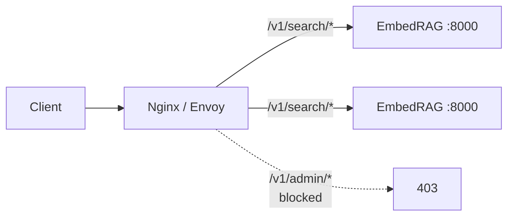

# Integration Guide

How to call EmbedRAG from another service when EmbedRAG is running as a **standalone networked service**.

> Looking to embed EmbedRAG **inside** a host service as a sub-capability (not a separate service)? See [embedding.md](embedding.md) instead.

---

## Summary matrix

| Pattern | Complexity | Auth / TLS | Scaling | Best for |
|---------|-----------|-----------|---------|----------|
| 1. Direct HTTP client | Minimal | No | Single node | Prototypes, scripts, quick wins |
| 2. OpenAPI SDK | Low | No | Single node | Typed clients in any language |
| 3. LangChain / LlamaIndex retriever | Low | No | Single node | LLM framework integration |
| 4. Reverse proxy gateway | Medium | Yes | Multi-node LB | Production with auth + TLS |
| 5. Docker / Kubernetes service | Medium | Via mesh | Horizontal | Container-native deployments |
| 6. OpenAI tool / function calling | Medium | No | Single node | Agent / tool-use LLM apps |

All six patterns work against the stock EmbedRAG query node — no source code changes required. The query node exposes a FastAPI app with permissive CORS and `/openapi.json` auto-generated.

---

## Pattern 1: Direct HTTP client (any language)

The simplest approach. Any application calls `/search/text` directly.

```python
import httpx

resp = httpx.post("http://embedrag:8000/search/text", json={
    "query_text": "What is causal inference?",
    "top_k": 5,
    "mode": "hybrid",
})
chunks = resp.json()["chunks"]
context = "\n\n".join(c["text"] for c in chunks)
```

```javascript
const resp = await fetch("http://embedrag:8000/search/text", {
  method: "POST",
  headers: { "Content-Type": "application/json" },
  body: JSON.stringify({ query_text: "What is RAG?", top_k: 5 }),
});
const { chunks } = await resp.json();
```

```bash
curl -s -X POST http://embedrag:8000/search/text \
  -H 'Content-Type: application/json' \
  -d '{"query_text":"what is RAG","top_k":5}'
```

**When to use**: prototypes, internal tools, ad-hoc scripting.
**Pros**: zero setup; works with any HTTP library in any language.
**Cons**: no retry / circuit-breaker; you manage the client yourself.

---

## Pattern 2: OpenAPI SDK auto-generation

The query node serves a live OpenAPI spec at `GET /openapi.json`. Feed it into an OpenAPI generator to produce typed clients.

```bash
# Python
pip install openapi-python-client
openapi-python-client generate \
  --url http://localhost:8000/openapi.json \
  --output embedrag-client

# TypeScript
npx openapi-typescript-codegen \
  --input http://localhost:8000/openapi.json \
  --output ./embedrag-sdk

# Go (via openapi-generator)
docker run --rm -v "${PWD}:/local" openapitools/openapi-generator-cli generate \
  -i http://host.docker.internal:8000/openapi.json \
  -g go -o /local/embedrag-go-client

# Java, Rust, Kotlin, Swift, etc. — same openapi-generator, different -g flag
```

The query node also renders interactive docs at `GET /docs` (Swagger UI) and `GET /redoc` (ReDoc) by default.

**When to use**: any team wanting typed clients without hand-writing them.
**Pros**: type-safe; auto-documented; 40+ target languages via openapi-generator.
**Cons**: regenerate when the API changes; some generators produce verbose output.
**Tip**: pin the generated client to a EmbedRAG version tag; regenerate on API version bumps.

---

## Pattern 3: LangChain / LlamaIndex custom retriever

Wrap EmbedRAG as a retriever plugin for popular LLM frameworks. The adapter class lives in your application — EmbedRAG is unchanged.

### LangChain

```python
from langchain_core.retrievers import BaseRetriever
from langchain_core.documents import Document
import httpx


class EmbedRAGRetriever(BaseRetriever):
    base_url: str = "http://localhost:8000"
    top_k: int = 5
    mode: str = "hybrid"
    space: str = "text"

    def _get_relevant_documents(self, query: str, **kwargs) -> list[Document]:
        resp = httpx.post(
            f"{self.base_url}/search/text",
            json={
                "query_text": query,
                "top_k": self.top_k,
                "mode": self.mode,
                "space": self.space,
            },
            timeout=10.0,
        )
        resp.raise_for_status()
        return [
            Document(
                page_content=c["text"],
                metadata={
                    "chunk_id": c["chunk_id"],
                    "doc_id": c["doc_id"],
                    "score": c["score"],
                    **c.get("metadata", {}),
                },
            )
            for c in resp.json()["chunks"]
        ]


retriever = EmbedRAGRetriever(base_url="http://embedrag:8000", top_k=10)
chain = ConversationalRetrievalChain.from_llm(llm, retriever)
```

### LlamaIndex

```python
from llama_index.core.retrievers import BaseRetriever
from llama_index.core.schema import NodeWithScore, TextNode
import httpx


class EmbedRAGRetriever(BaseRetriever):
    def __init__(self, base_url="http://localhost:8000", top_k=5, **kwargs):
        super().__init__(**kwargs)
        self._base_url = base_url
        self._top_k = top_k

    def _retrieve(self, query_bundle):
        resp = httpx.post(
            f"{self._base_url}/search/text",
            json={"query_text": query_bundle.query_str, "top_k": self._top_k},
            timeout=10.0,
        )
        return [
            NodeWithScore(
                node=TextNode(
                    text=c["text"],
                    id_=c["chunk_id"],
                    metadata={"doc_id": c["doc_id"], **c.get("metadata", {})},
                ),
                score=c["score"],
            )
            for c in resp.json()["chunks"]
        ]
```

**When to use**: your app already uses LangChain / LlamaIndex and wants EmbedRAG as the retrieval backend.
**Pros**: plugs into existing chains, query engines, agents seamlessly.
**Cons**: adds framework dependency in the calling app.

---

## Pattern 4: Nginx / Envoy reverse proxy gateway

Put EmbedRAG behind a reverse proxy to add auth, rate limiting, TLS, and load balancing — without touching EmbedRAG code.



Example `nginx.conf` sketch:

```nginx
upstream embedrag_query {
    least_conn;
    server query-a:8000 max_fails=3 fail_timeout=10s;
    server query-b:8000 max_fails=3 fail_timeout=10s;
}

limit_req_zone $binary_remote_addr zone=api:10m rate=100r/s;

server {
    listen 443 ssl http2;
    server_name rag.example.com;

    ssl_certificate     /etc/ssl/fullchain.pem;
    ssl_certificate_key /etc/ssl/privkey.pem;

    location /v1/ {
        if ($http_x_api_key != "secret-key") { return 403; }
        limit_req zone=api burst=50 nodelay;

        proxy_pass http://embedrag_query/;
        proxy_set_header Host $host;
        proxy_set_header X-Real-IP $remote_addr;
        proxy_read_timeout 30s;
    }

    # Never expose /admin/* externally
    location /v1/admin/ { return 404; }
}
```

**When to use**: production deployments needing TLS, auth, rate limiting, multi-node load balancing.
**Pros**: standard infra pattern; EmbedRAG stays untouched; easy horizontal scaling.
**Cons**: one more component to operate.
**Security note**: always block `/admin/*` routes at the gateway. They are intended for localhost / internal automation only.

---

## Pattern 5: Docker / Kubernetes service

Deploy EmbedRAG as a standalone cluster-internal `Service`. Your application talks to it over Kubernetes DNS.

```yaml
apiVersion: v1
kind: Service
metadata:
  name: embedrag-query
  namespace: platform
spec:
  selector:
    app: embedrag-query
  ports:
    - port: 8000
      targetPort: 8000
---
apiVersion: apps/v1
kind: Deployment
metadata:
  name: embedrag-query
  namespace: platform
spec:
  replicas: 3
  selector:
    matchLabels: { app: embedrag-query }
  template:
    metadata:
      labels: { app: embedrag-query }
    spec:
      containers:
        - name: query
          image: mycorp/embedrag:v0.6.0
          args:
            - uvicorn
            - embedrag.query.app:create_query_app
            - --factory
            - --host=0.0.0.0
            - --port=8000
          readinessProbe:
            httpGet: { path: /readiness, port: 8000 }
            initialDelaySeconds: 10
            periodSeconds: 5
          livenessProbe:
            httpGet: { path: /health, port: 8000 }
            periodSeconds: 15
          resources:
            requests: { cpu: "1", memory: 4Gi }
            limits:   { cpu: "4", memory: 16Gi }
          volumeMounts:
            - name: snapshot
              mountPath: /data/embedrag
      volumes:
        - name: snapshot
          emptyDir: { sizeLimit: 20Gi }
```

Calling apps use the service DNS name:

```python
httpx.post("http://embedrag-query.platform.svc:8000/search/text", json={...})
```

**When to use**: container-native or Kubernetes environments where EmbedRAG serves many unrelated callers.
**Pros**: leverages existing `/health` and `/readiness` endpoints; natural horizontal scaling.
**Cons**: requires container orchestration knowledge; a dedicated service to operate.

---

## Pattern 6: OpenAI-compatible tool / function calling

If your application uses OpenAI / Claude / Gemini function calling, expose EmbedRAG as a tool definition. No EmbedRAG changes — you only add a tool schema to your LLM prompt.

```json
{
  "type": "function",
  "function": {
    "name": "search_knowledge_base",
    "description": "Search the internal knowledge base for relevant documents. Use for factual questions.",
    "parameters": {
      "type": "object",
      "properties": {
        "query":  { "type": "string",  "description": "The search query" },
        "top_k":  { "type": "integer", "default": 5 }
      },
      "required": ["query"]
    }
  }
}
```

Your orchestrator intercepts the tool call and forwards to EmbedRAG:

```python
import httpx

def handle_tool_call(name: str, args: dict) -> str:
    if name == "search_knowledge_base":
        resp = httpx.post(
            "http://embedrag:8000/search/text",
            json={
                "query_text": args["query"],
                "top_k": args.get("top_k", 5),
            },
            timeout=10.0,
        )
        chunks = resp.json()["chunks"]
        return "\n\n---\n\n".join(
            f"[{c['doc_id']}] {c['text']}" for c in chunks
        )
    raise ValueError(f"Unknown tool: {name}")
```

**When to use**: ChatGPT / Claude / Gemini tool-use patterns; agent platforms (Dify, Coze, LangGraph, etc.).
**Pros**: the LLM decides when to search; clean separation of concerns.
**Cons**: requires an orchestrator layer to broker the tool call.

---

## Query-node endpoint cheatsheet

Common endpoints you will call from integrations. Full list in `GET /openapi.json`.

| Method | Path | Purpose |
|--------|------|---------|
| `POST` | `/search/text` | Text-in, chunks-out — **the default for most integrations** |
| `POST` | `/search` | Pre-embedded vector search (skip internal embedding call) |
| `POST` | `/search/multi` | Cross-space late fusion (multi-modal) |
| `POST` | `/api/rerank` | Optional reranking proxy (calls out to a rerank model) |
| `GET`  | `/health` | Liveness probe |
| `GET`  | `/readiness` | Readiness probe (503 until first snapshot loaded) |
| `GET`  | `/api/spaces` | List configured embedding spaces |
| `GET`  | `/api/chunks/{chunk_id}/neighbors?before=3&after=3` | Surrounding context by chunk id |
| `GET`  | `/openapi.json` | Machine-readable API spec |
| `GET`  | `/docs` | Interactive Swagger UI |

Endpoints under `/admin/*` (sync trigger, hotfix, reload) are for operators — never expose them to untrusted callers.
